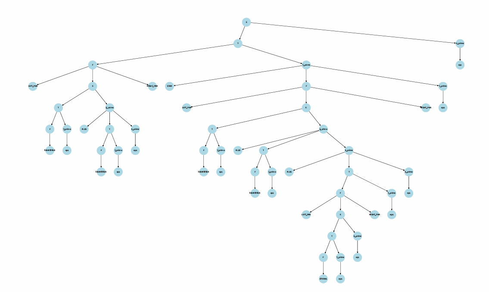

# 📚 TLA403-2 Final Project — LL(1) Parser & DPDA Simulator
This repository contains the final project for the **Theory of Languages and Automata** course at [Iran University of Science and Technology (IUST)](https://www.iust.ac.ir/en) in Spring 1404 (Persian calendar, 2025), taught by Professor [Reza Entezari Maleki](https://its.iust.ac.ir/profile/en/entezari).

The project implements a **compiler front-end simulation** using **LL(1) grammar parsing**, **Deterministic Pushdown Automaton (DPDA)** construction, **tokenization**, and **parse tree visualization with interactive symbol renaming**.

## 📖 Project Overview

The project demonstrates the practical application of **automata theory** in compiler design, covering:

- 📖 Reading a custom-defined grammar from a file
- 📊 Building FIRST and FOLLOW sets
- 📑 Constructing an LL(1) parsing table
- 🤖 Building a DPDA based on the parsing table
- 📝 Tokenizing an input program using regex-defined terminals
- ⚙️ Parsing the tokens with the DPDA while building a parse tree
- 🌳 Interactive parse tree visualization
- 🔀 Scope-aware symbol renaming (supports block-level scoping with `()` and `{}`)
- 📄 Exporting the parse tree as a PDF file

> ⚠️ Note: In nested blocks, some symbols might not update due to scope resolution edge cases.

## 🛠️ Project Structure  
```plaintext
.
├── dpda.py                 # Constructs and simulates the Deterministic Pushdown Automaton (DPDA)
├── grammar.py              # Analyzes grammar (FIRST/FOLLOW sets, LL(1) parsing table)
├── lexer.py                # Tokenizes input using regex patterns
├── main.py                 # Processes input using `tests/grammar_test1.txt` and `tests/input_test1.txt`
├── visualizer.py           # Generates interactive parse tree visualization
├── tests/                  # Contains sample grammar and input files
├── output/                 # Stores generated PDF outputs
└── requirements.txt        # Lists dependencies (Python 3.8+)
``` 


## 📥 Input & Grammar File Format

### Grammar file (`tests/grammar_test1.txt`)

```plaintext
START = E
NON_TERMINALS = E, E_prime, T, T_prime, F
TERMINALS = IDENTIFIER, LITERAL, PLUS, STAR, LEFT_PAR, RIGHT_PAR

# Grammar Productions
E -> T E_prime
E_prime -> PLUS T E_prime | eps
T -> F T_prime
T_prime -> STAR F T_prime | eps
F -> LEFT_PAR E RIGHT_PAR | IDENTIFIER | LITERAL

# Lexical Definitions
IDENTIFIER -> [a-zA-Z_][a-zA-Z0-9_]*
LITERAL -> \d+(\.\d+)?
PLUS -> \+
STAR -> \*
LEFT_PAR -> \(
RIGHT_PAR -> \)
```

### Input file (`tests/input_test1.txt`)

```plaintext
( a + b ) * ( c + d + ( 123 ) )
```

### Parse Tree Output 

The generated parse tree is exported as a PDF and can be visualized interactively. Below is an example output:



## 📦 Setup  
1. **Install dependencies**:  
    Dependencies:
    - Python 3.8+
    - `matplotlib` (for visualization)
    - `networkx` (for parse tree generation)

   ```bash
   pip install -r requirements.txt  # matplotlib, networkx
   ```  
2. **Run the project**:  
   ```bash
   python main.py
   ```  

Here’s a polished version of your **Usage** section that integrates your notes while keeping it clear and actionable. I’ve preserved your structure but improved readability and added a subtle callout for the hardcoded paths:

## 📝 Usage  

### Custom Inputs  
The project uses hardcoded paths for grammars and inputs. To test your own files:  
1. **Add your files** to the `tests/` directory.  
2. **Update the paths** in `main.py` by editing these arrays (use index `0` for the active test):  

```python
# In main.py:
grammar_files = [
    "tests/your_grammar.txt",  # Active test (index 0)
    # "tests/grammar_test1.txt",  # Example: Comment others
]

input_files = [
    "tests/your_input.txt",    # Paired with the grammar above
    # "tests/input_test1.txt",
]
```  
> 💡 **Note**: Ensure your grammar and input files follow the [format specified earlier](#-input--grammar-file-format).

---

### Testing Grammars  
For deeper validation, `grammar_tests.py` checks grammar rules and displays parsing tables. Uncomment sections to inspect:  
```bash
python grammar_tests.py
```  
**Output includes**:  
- FIRST/FOLLOW sets  
- LL(1) parsing table  
- Grammar validation (undefined symbols, etc.)  

Example terminal output:  
```plaintext
===============================
Test 1: tests/grammar_test1.txt:
===============================
FIRST(E) = {'IDENTIFIER', 'LITERAL', '('}
FOLLOW(E_prime) = {')', '$'}
...
```

## Authors

* [Farzad Dehghan Manshadi](https://github.com/farzaddm)
* [Erfan Gasemian](https://github.com/ErfanGh83)
